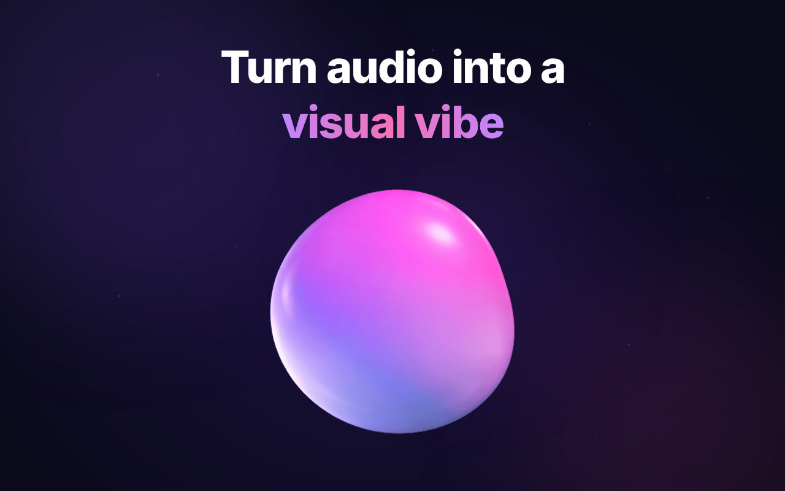

<div align="center">
  
  <h1>Sonic Blob</h1>
</div>

Sonic Blob is a Chrome extension that turns audio from the active browser tab into a fluid, immersive 3D music visualizer.

<div align="center">
  
</div>

Built with React, TypeScript, Vite, and Three.js, it captures tab audio, opens a dedicated visualizer view, and renders a reactive blob that responds in real time. The project also includes configurable visuals, persistent settings, fullscreen mode, and import/export support for custom presets.

## Overview

Sonic Blob is designed as a lightweight browser-based visual experience for music, videos, and any other tab-based audio source. Instead of running inside a small popup, the extension launches a dedicated page for the visualizer, creating a more immersive viewing experience.

The project focuses on:

- real-time tab audio capture
- smooth 3D deformation and motion
- customizable visual controls
- a clean extension workflow built on modern frontend tooling

## Features

- **Real-time tab audio visualization** using the Chrome `tabCapture` API
- **Dedicated visualizer tab** launched from the extension action
- **Three.js-powered 3D blob** with dynamic deformation
- **Configurable controls** for:
  - polygon detail
  - base size
  - ripple depth
  - sensitivity
  - rotation speed
  - blob lighting colors
  - background color
- **About Section**: Detailed project information, creator links, and contact options.
- **Improved UI Overlay**: Consistent translucency and glassmorphism across controls, about, and tutorial dialogues.
- **Fullscreen mode** for a more immersive experience
- **Auto-hiding UI** to keep the visualizer unobstructed
- **Persistent configuration** with local storage
- **Preset export/import** through JSON config download and upload
- **Automated Store Screenshots**: Specialized Playwright-based system for generating high-quality Chrome Web Store promotional assets.

## Tech Stack

- **React**
- **TypeScript**
- **Vite**
- **Three.js**
- **simplex-noise**
- **Tailwind CSS v4**
- **Chrome Extensions Manifest V3**
- **ESLint & Prettier**

## How It Works

1. The user starts audio playback in any browser tab.
2. They click the Sonic Blob extension icon.
3. The extension background service worker requests a media stream ID for the active tab.
4. Sonic Blob opens a dedicated extension page and passes that stream ID to it.
5. The visualizer page captures the tab audio stream, analyzes frequency data, and updates the 3D scene in real time.

## Project Structure

```txt
sonic-blob/
├── public/
│   ├── favicon.png
│   ├── favicon.svg
│   ├── manifest.json
│   └── sonic-blob-config.json
├── src/
│   ├── components/
│   │   ├── AboutModal.tsx
│   │   ├── ControlPanel.tsx
│   │   ├── Scene.tsx
│   │   ├── TutorialOverlay.tsx
│   │   └── UIOverlay.tsx
│   ├── App.tsx
│   ├── audio.ts
│   ├── background.ts
│   ├── main.tsx
│   ├── store.ts
│   └── style.css
├── screenshots/
│   ├── assets/        (Source assets & navigation script)
│   ├── slide-1.html   (Promotional slide templates)
│   └── slide-1.png    (Generated store assets)
├── scripts/
│   └── capture-screenshots.js (Playwright automation)
├── .prettierrc
├── eslint.config.js
├── index.html
├── package.json
├── tsconfig.json
└── vite.config.ts
```

## Getting Started

### Installation

1.  Clone this repository:
    ```bash
    git clone https://github.com/yourusername/sonic-blob.git
    cd sonic-blob
    ```
2.  Install dependencies:
    ```bash
    npm install
    ```
3.  Build the project:
    ```bash
    npm run build
    ```
4.  Load the extension in Chrome:
    - Open `chrome://extensions/`.
    - Enable **Developer mode**.
    - Click **Load unpacked** and select the `/dist` directory.

### Development Commands

- `npm run dev`: Run the Vite development server.
- `npm run build`: Type-check and build the project for production.
- `npm run preview`: Preview the production build locally.
- `npm run lint`: Run ESLint to analyze code quality.
- `npm run format`: Format the code using Prettier.
- `npm run capture-screenshots`: Automatically generate high-quality 1280x800 promotional screenshots for the Chrome Web Store using Playwright.

### Usage

1.  Open any tab with audio playing (e.g., YouTube, Spotify).
2.  Click the Sonic Blob extension icon.
3.  Enjoy the visualization! Use the **Controls** button to customize the blob and the **About** button to see more about the project.

## Built With

- [React](https://react.dev/) - UI Library
- [Three.js](https://threejs.org/) - 3D Engine
- [Vite](https://vitejs.dev/) - Frontend Tooling
- [Tailwind CSS](https://tailwindcss.com/) - Styling
- [TypeScript](https://www.typescriptlang.org/) - Type Safety
- [Simplex Noise](https://github.com/jwagner/simplex-noise.js) - Smooth procedural deformation
- [ESLint](https://eslint.org/) & [Prettier](https://prettier.io/) - Code Quality & Formatting

## License

This project is licensed under the MIT License - see the [LICENSE](LICENSE) file for details.

## Contributing

Contributions are welcome! Please feel free to submit a Pull Request.
